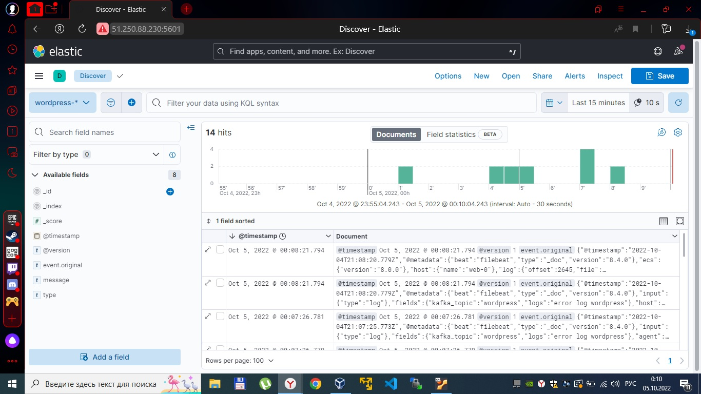

## Homework_7 - реализация очереди для сборщика логов между logstash и elasticsearch 

Данный Terraform-стенд развертывает следующую конфигурацию:
* 2 виртуальные машины для Nginx, Keepalived
* 3 виртуальные машины для Nginx, PHP-FPM, WordPress, Filebeat
* 3 виртуальные машины для кластера InnoDB 
* 1 виртуальная машина для ISCSI
* 1 виртуальная машина для Kafka
* 1 виртуальная машина для ELK

### Используемые инструменты:

* Git
* Ansible
* Terraform

### Описание файлов Terraform:

* .terraformrc - конфигурация Terraform CLI
* main.tf - описание провайдера
* balancers.tf - описание виртуальных машин для Nginx, Keepalived
* web.tf - описание виртуальных машин для Nginx, PHP-FPM, WordPress, Filebeat
* db.tf - описание виртуальных машин для кластера InnoDB
* iscsi.tf - описание виртуальной машины для ISCSI
* kafka.tf - описание виртуальной машины для Kafka
* elk.tf - описание виртуальной машины для ELK
* vpc.tf - описание сетевых настроек
* outputs.tf - вывод IP-адресов созданных виртуальных машин, создание файла инвентаря Ansible, файлов hosts, конфигурационного файла Nginx
* hosts.tpl - шаблон для формирования файла hosts
* inventory.tpl - шаблон для формирования файла инвентаря Ansible
* load_balancer.conf.tpl - шаблон для формирования конфигурационного файла балансировщика в Nginx
* meta.txt - пользовательские метаданные
* terraform.tfvars - значения переменных
* variables.tf - описание типов переменных

### Описание ролей Ansible:

* config-gfs2 - роль для настройки GFS2
* iscsi-client - роль для установки и настройки инициатора iscsi
* iscsi-target - роль для установки и настройки таргета iscsi
* load_balancer -роль для установки и настройки Nginx, Keepalived  
* mysql - роль для установки и настройки MySQL
* pacemaker - роль для установки и настройки pacemaker
* tune-cluster - роль для создания ресурсов в Pacemaker
* web - роль для установки и настройки Nginx, PHP-FPM
* wp - роль для установки и настройки WordPress
* filebeat - роль для установки и настройки Filebeat
* kafka - роль для установки и настройки Kafka
* elk - роль для установки и настройки ELK

### Порядок запуска:

1. Скопировать данный репозиторий ```git clone <this repo>```
2. Сгенерировать открытый и закрытый ключ для доступа к виртуальной машине ```ssh-keygen``` 
3. Отредактировать файлы ```meta.txt``` и ```terraform.tfvars```
4. Перейти в каталог terraform и последовательно выполнить команды ```terraform init``` ```terraform plan``` ```terraform apply```
5. Перейти в каталог ansible и выполнить команду ```ansible-playbook main.yml```

### Настройка кластера InnoDB:

1. Запуcтить клиент командной строки и редактор кода для MySQL ```mysqlsh```
```js
    MySQL Shell 8.0.29

    Copyright (c) 2016, 2022, Oracle and/or its affiliates.
    Oracle is a registered trademark of Oracle Corporation and/or its affiliates.
    Other names may be trademarks of their respective owners.

    Type '\help' or '\?' for help; '\quit' to exit.
```
2. Настроить локальный экземпляр для использования MySQL InnoDB Cluster на всех нодах ```dba.configureLocalInstance("root@localhost:3306");```
```js
    Please provide the password for 'root@localhost:3306': **********
    Save password for 'root@localhost:3306'? [Y]es/[N]o/Ne[v]er (default No): y
    Configuring local MySQL instance listening at port 3306 for use in an InnoDB cluster...

    This instance reports its own address as db-0:3306
    Clients and other cluster members will communicate with it through this address by default. If this is not correct, the report_host MySQL system variable should be changed.

    ERROR: User 'root' can only connect from 'localhost'. New account(s) with proper source address specification to allow remote connection from all instances must be created to manage the cluster.

    1) Create remotely usable account for 'root' with same grants and password
    2) Create a new admin account for InnoDB cluster with minimal required grants
    3) Ignore and continue
    4) Cancel

    Please select an option [1]: 2
    Please provide an account name (e.g: icroot@%) to have it created with the necessary
    privileges or leave empty and press Enter to cancel.
    Account Name: clusteradmin@%
    Password for new account: **********
    Confirm password: **********

    applierWorkerThreads will be set to the default value of 4.

    NOTE: Some configuration options need to be fixed:
    +----------------------------------------+---------------+----------------+--------------------------------------------------+
    | Variable                               | Current Value | Required Value | Note                                             |
    +----------------------------------------+---------------+----------------+--------------------------------------------------+
    | binlog_transaction_dependency_tracking | COMMIT_ORDER  | WRITESET       | Update the server variable                       |
    | enforce_gtid_consistency               | OFF           | ON             | Update read-only variable and restart the server |
    | gtid_mode                              | OFF           | ON             | Update read-only variable and restart the server |
    | server_id                              | 1             | <unique ID>    | Update read-only variable and restart the server |
    +----------------------------------------+---------------+----------------+--------------------------------------------------+

    Some variables need to be changed, but cannot be done dynamically on the server.
    Do you want to perform the required configuration changes? [y/n]: y
    Do you want to restart the instance after configuring it? [y/n]: y

    Cluster admin user 'clusteradmin'@'%' created.
    Configuring instance...
    The instance 'db-0:3306' was configured to be used in an InnoDB cluster.
    Restarting MySQL...
    NOTE: MySQL server at db-0:3306 was restarted.
```
3. Подключаемся к первому локальному экземпляру ```shell.connect('clusteradmin@db-0:3306');```
```js
    Creating a session to 'clusteradmin@db-0:3306'
    Please provide the password for 'clusteradmin@db-0:3306': **********                                 
    Save password for 'clusteradmin@db-0:3306'? [Y]es/[N]o/Ne[v]er (default No): y
    Fetching schema names for autocompletion... Press ^C to stop.
    Your MySQL connection id is 9
    Server version: 8.0.30 MySQL Community Server - GPL
    No default schema selected; type \use <schema> to set one.
    <ClassicSession:clusteradmin@db-0:3306>
```
4. Создаем InnoDB кластер ```cluster = dba.createCluster('my_innodb_cluster', {ipAllowlist: '192.168.10.1,192.168.10.2,192.168.10.3,db-0,db-1,db-2'});```
```js
    A new InnoDB cluster will be created on instance 'db-0:3306'.

    Validating instance configuration at db-0:3306...

    This instance reports its own address as db-0:3306

    Instance configuration is suitable.
    NOTE: Group Replication will communicate with other members using 'db-0:33061'. Use the localAddress option to override.

    Creating InnoDB cluster 'my_innodb_cluster' on 'db-0:3306'...

    Adding Seed Instance...
    Cluster successfully created. Use Cluster.addInstance() to add MySQL instances.
    At least 3 instances are needed for the cluster to be able to withstand up to
    one server failure.
```
5. Добавляем второй экземпляр в кластер InnoDB ```cluster.addInstance('clusteradmin@db-1:3306', {ipAllowlist: '192.168.10.1,192.168.10.2,192.168.10.3,db-0,db-1,db-2'});```
```js
    NOTE: The target instance 'db-1:3306' has not been pre-provisioned (GTID set is empty). The Shell is unable to decide whether incremental state recovery can correctly provision it.
    The safest and most convenient way to provision a new instance is through automatic clone provisioning, which will completely overwrite the state of 'db-1:3306' with a physical snapshot from an existing cluster member. To use this method by default, set the 'recoveryMethod' option to 'clone'.

    The incremental state recovery may be safely used if you are sure all updates ever executed in the cluster were done with GTIDs enabled, there are no purged transactions and the new instance contains the same GTID set as the cluster or a subset of it. To use this method by default, set the 'recoveryMethod' option to 'incremental'.


    Please select a recovery method [C]lone/[I]ncremental recovery/[A]bort (default Clone): 
    Validating instance configuration at db-1:3306...

    This instance reports its own address as db-1:3306

    Instance configuration is suitable.
    NOTE: Group Replication will communicate with other members using 'db-1:33061'. Use the localAddress option to override.

    A new instance will be added to the InnoDB cluster. Depending on the amount of
    data on the cluster this might take from a few seconds to several hours.

    Adding instance to the cluster...

    Monitoring recovery process of the new cluster member. Press ^C to stop monitoring and let it continue in background.
    Clone based state recovery is now in progress.

    NOTE: A server restart is expected to happen as part of the clone process. If the
    server does not support the RESTART command or does not come back after a
    while, you may need to manually start it back.

    * Waiting for clone to finish...
    NOTE: db-1:3306 is being cloned from db-0:3306
    ** Stage DROP DATA: Completed
    ** Clone Transfer  
        FILE COPY  ############################################################  100%  Completed
        PAGE COPY  ############################################################  100%  Completed
        REDO COPY  ############################################################  100%  Completed

    NOTE: db-1:3306 is shutting down...

    * Waiting for server restart... ready 
    * db-1:3306 has restarted, waiting for clone to finish...
    ** Stage RESTART: Completed
    * Clone process has finished: 72.61 MB transferred in about 1 second (~72.61 MB/s)

    State recovery already finished for 'db-1:3306'

    The instance 'db-1:3306' was successfully added to the cluster.
```
6. Добавляем третий экземпляр в кластер InnoDB ```cluster.addInstance('clusteradmin@db-2:3306', {ipAllowlist: '192.168.10.1,192.168.10.2,192.168.10.3,db-0,db-1,db-2'});```
```js
    NOTE: The target instance 'db-2:3306' has not been pre-provisioned (GTID set is empty). The Shell is unable to decide whether incremental state recovery can correctly provision it.
    The safest and most convenient way to provision a new instance is through automatic clone provisioning, which will completely overwrite the state of 'db-2:3306' with a physical snapshot from an existing cluster member. To use this method by default, set the 'recoveryMethod' option to 'clone'.

    The incremental state recovery may be safely used if you are sure all updates ever executed in the cluster were done with GTIDs enabled, there are no purged transactions and the new instance contains the same GTID set as the cluster or a subset of it. To use this method by default, set the 'recoveryMethod' option to 'incremental'.


    Please select a recovery method [C]lone/[I]ncremental recovery/[A]bort (default Clone): 
    Validating instance configuration at db-2:3306...

    This instance reports its own address as db-2:3306

    Instance configuration is suitable.
    NOTE: Group Replication will communicate with other members using 'db-2:33061'. Use the localAddress option to override.

    A new instance will be added to the InnoDB cluster. Depending on the amount of
    data on the cluster this might take from a few seconds to several hours.

    Adding instance to the cluster...

    Monitoring recovery process of the new cluster member. Press ^C to stop monitoring and let it continue in background.
    Clone based state recovery is now in progress.

    NOTE: A server restart is expected to happen as part of the clone process. If the
    server does not support the RESTART command or does not come back after a
    while, you may need to manually start it back.

    * Waiting for clone to finish...
    NOTE: db-2:3306 is being cloned from db-1:3306
    ** Stage DROP DATA: Completed
    ** Clone Transfer  
        FILE COPY  ############################################################  100%  Completed
        PAGE COPY  ############################################################  100%  Completed
        REDO COPY  ############################################################  100%  Completed

    NOTE: db-2:3306 is shutting down...

    * Waiting for server restart... ready 
    * db-2:3306 has restarted, waiting for clone to finish...
    ** Stage RESTART: Completed
    * Clone process has finished: 72.61 MB transferred in about 1 second (~72.61 MB/s)

    State recovery already finished for 'db-2:3306'

    The instance 'db-2:3306' was successfully added to the cluster.
```
7. Проверяем текущий статус кластера InnoDB ```cluster.status()```
```js
    {
        "clusterName": "my_innodb_cluster", 
        "defaultReplicaSet": {
            "name": "default", 
            "primary": "db-0:3306", 
            "ssl": "REQUIRED", 
            "status": "OK", 
            "statusText": "Cluster is ONLINE and can tolerate up to ONE failure.", 
            "topology": {
                "db-0:3306": {
                    "address": "db-0:3306", 
                    "memberRole": "PRIMARY", 
                    "mode": "R/W", 
                    "readReplicas": {}, 
                    "replicationLag": null, 
                    "role": "HA", 
                    "status": "ONLINE", 
                    "version": "8.0.30"
                }, 
                "db-1:3306": {
                    "address": "db-1:3306", 
                    "memberRole": "SECONDARY", 
                    "mode": "R/O", 
                    "readReplicas": {}, 
                    "replicationLag": null, 
                    "role": "HA", 
                    "status": "ONLINE", 
                    "version": "8.0.30"
                }, 
                "db-2:3306": {
                    "address": "db-2:3306", 
                    "memberRole": "SECONDARY", 
                    "mode": "R/O", 
                    "readReplicas": {}, 
                    "replicationLag": null, 
                    "role": "HA", 
                    "status": "ONLINE", 
                    "version": "8.0.30"
                }
            }, 
            "topologyMode": "Single-Primary"
        }, 
        "groupInformationSourceMember": "db-0:3306"
    }
```
8. Переключаем кластер в режим мультимастера ```cluster.switchToMultiPrimaryMode()```
```js
    Switching cluster 'my_innodb_cluster' to Multi-Primary mode...

    Instance 'db-1:3306' was switched from SECONDARY to PRIMARY.
    Instance 'db-0:3306' remains PRIMARY.
    Instance 'db-2:3306' was switched from SECONDARY to PRIMARY.

    The cluster successfully switched to Multi-Primary mode.
```

### Настройка MySQL Router на web серверах:

1. Выполняем команду ```mysqlrouter --bootstrap clusteradmin@db-0:3306 --directory /home/user/myrouter --conf-use-sockets --account routerfriend --account-create always```
```js
    Please enter MySQL password for clusteradmin: 
    # Bootstrapping MySQL Router instance at '/home/user/myrouter'...

    Please enter MySQL password for routerfriend: 
    - Creating account(s) 
    - Verifying account (using it to run SQL queries that would be run by Router)
    - Storing account in keyring
    - Adjusting permissions of generated files
    - Creating configuration /home/user/myrouter/mysqlrouter.conf

    # MySQL Router configured for the InnoDB Cluster 'my_innodb_cluster'

    After this MySQL Router has been started with the generated configuration

        $ mysqlrouter -c /home/user/myrouter/mysqlrouter.conf

    InnoDB Cluster 'my_innodb_cluster' can be reached by connecting to:

    ## MySQL Classic protocol

    - Read/Write Connections: localhost:6446, /home/user/myrouter/mysql.sock
    - Read/Only Connections:  localhost:6447, /home/user/myrouter/mysqlro.sock

    ## MySQL X protocol

    - Read/Write Connections: localhost:6448, /home/user/myrouter/mysqlx.sock
    - Read/Only Connections:  localhost:6449, /home/user/myrouter/mysqlxro.sock
```
2. Запускаем MySQL Router ```/home/user/myrouter/start.sh ```

### Отображение логов Nginx в Kibana:

[](nginx.jpg)

### Отображение логов WordPress в Kibana:

[](wordpress.jpg)